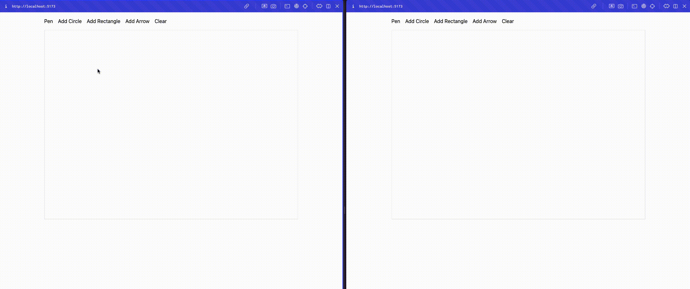

# Collaborative Drawing Board POC

This project is a real-time collaborative drawing board application POC (proof of concept) built with a **React** frontend and an **Express/Socket.IO** backend. It allows users to draw paths, add shapes (circles and rectangles), connect shapes with arrows, and see changes live as other users update the board.



## Features

- **Real-time Collaboration**: See updates from other users in real time.
- **Drawing Paths**: Use the "Pen" tool to draw freehand paths.
- **Shape Tools**: Add circles and rectangles to the canvas.
- **Arrow Tool**: Draw arrows connecting selected shapes, which update dynamically when shapes are moved.
- **Clear Canvas**: Clear the canvas for all users at once.

## Tech Stack

- **Frontend**: React, Fabric.js, Socket.IO Client, Vite
- **Backend**: Express, Socket.IO, Node.js

## Project Structure

```plaintext
project-root/
├── backend/
│   ├── app.js            # Express server with Socket.IO setup
│   └── package.json      # Backend dependencies and scripts
└── frontend/
    ├── src/
    │   └── App.jsx       # Main React component with Fabric.js and Socket.IO integration
    └── package.json      # Frontend dependencies and scripts
```

## Setup

### Prerequisites

Ensure you have **Node.js** and **Yarn** installed.

### Installation

1. Clone the repository:

   ```bash
   git clone <repository-url>
   cd project-root
   ```

2. Install dependencies for both backend and frontend:
   ```bash
   cd backend
   yarn install
   cd ../frontend
   yarn install
   ```

### Running the Application

1. Start the backend server:

   ```bash
   cd backend
   yarn dev
   ```

   The backend server will start on `http://localhost:4000`.

2. Start the frontend:
   ```bash
   cd frontend
   yarn dev
   ```
   The frontend will open in the browser on `http://localhost:5173`.

### Usage

- **Pen**: Toggle drawing mode to draw freehand paths.
- **Add Circle**: Add a circle shape to the canvas.
- **Add Rectangle**: Add a rectangle shape to the canvas.
- **Add Arrow**: Connect two selected shapes (rectangles or circles) with an arrow.
- **Clear**: Clear the canvas for all connected users.

### License

This project is licensed under the MIT License.
